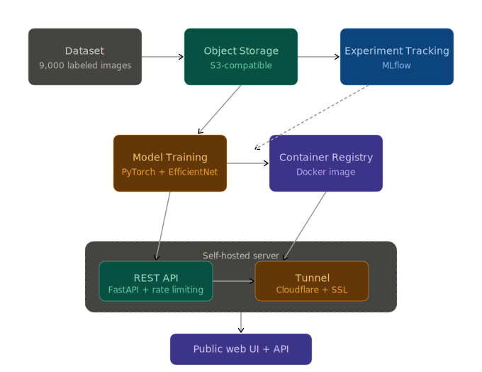

# FishID 🐟

**Fish species classifier — upload a photo, get an ID.**


🌐 **[Try it live → fishid.binhtvu.com](https://fishid.binhtvu.com)**

99.26% test accuracy across 9 species. Built with PyTorch + EfficientNet, served via FastAPI, deployed on self-hosted infrastructure with Cloudflare.

---

## Tech Stack




## Species
Black Sea Sprat · Gilt-Head Bream · Hourse Mackerel · Red Mullet · Red Sea Bream · Sea Bass · Shrimp · Striped Red Mullet · Trout

## Quick Start

```bash
docker pull binhvu3/fishid:latest
docker run -p 8000:8000 binhvu3/fishid:latest
```

```bash
curl -X POST "http://localhost:8000/predict" \
  -F "file=@fish.jpg"
# {"species": "Trout", "confidence": 99.76}
```

## Links
- 🌐 [Live Demo](https://fishid.binhtvu.com)
- 📖 [API Docs](https://fishid.binhtvu.com/docs)
- 🐳 [DockerHub](https://hub.docker.com/r/binhvu3/fishid)

## Project Structure
```text
fishid/
├── notebooks/   # EDA → preprocessing → training → evaluation → inference
├── src/         # FastAPI app + frontend + sample images
├── models/      # trained model checkpoints
└── outputs/     # charts and evaluation results
```

## Setup
```bash
conda env create -f environment.yml
conda activate datascience
```

## Development

### Run Locally
```bash
uvicorn src.app:app --reload --port 8000
```

### Build and Push Multi-Platform Image
```bash
# Builds for AMD64 (Proxmox) and ARM64 (Apple Silicon)
docker buildx create --use
docker buildx build --platform linux/amd64,linux/arm64 -t binhvu3/fishid:latest --push .
```

### Build Locally Only
```bash
docker build -t fishid .
docker run -p 8000:8000 fishid
```

### Test Rate Limiting
```bash
python tests/test_rate_limit.py
```

### Health Check
```bash
curl https://fishid.binhtvu.com/health
```

### API Routes
```bash
# Predict
curl -X POST "https://fishid.binhtvu.com/predict" \
  -H "accept: application/json" \
  -F "file=@/path/to/fish.jpg"

# Example response
# {"species": "Trout", "confidence": 99.76}
```

## Notebooks
- `01_eda.ipynb` → dataset exploration and visualization
- `02_preprocessing.ipynb` → data pipeline and transforms
- `03_training.ipynb` → model training with MLflow tracking
- `04_evaluation.ipynb` → model evaluation and metrics
- `05_inference.ipynb` → inference and deployment prep

## License
MIT